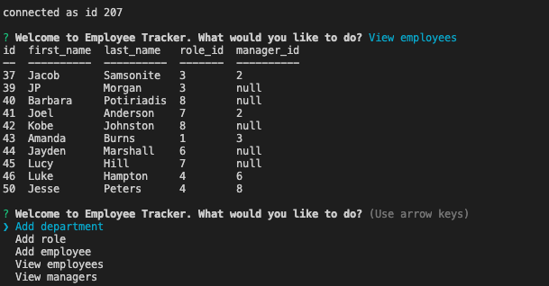
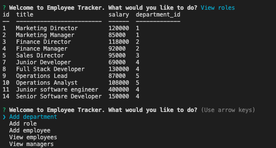
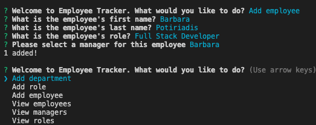
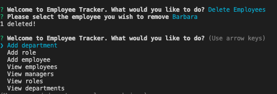

# MySQL-Employee-Tracker

## Description

An Employment Management System designed to architect and manage a company's employees using Node.js, My SQL and Inquirer. 

The application allows users to add employees, roles and departments, view employees, roles and departments, update employee roles and delete roles and employees.

## User story

As a business owner, 
I WANT to be able to view and manage my employee database, which include the departments, roles and employees,
SO THAT I can organise and plan my business.

## Deployed Application

https://drive.google.com/file/d/10QKepTv7aqd8F3663eIP48RBgjXbRfRY/view

